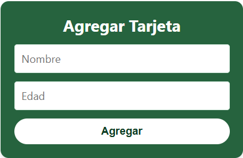
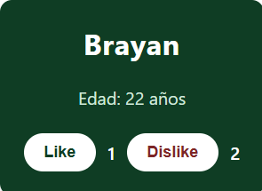

# App con Angular

Esta es una aplicación interactiva construida en Angular para aprender y practicar los conceptos básicos del framework como el **Two-Way Data Binding**, la creación de **componentes** y el manejo de **Eventos**.

## Características Principales

La aplicación te permite añadir dinámicamente tarjetas a un panel, especificando el nombre y la edad. Además, cada tarjeta guarda su propio estado de interacción mediante un contador de _Likes_ y _Dislikes_.

### 1. Panel para Agregar Tarjetas
A través del uso de `[(ngModel)]`, el formulario recibe y actualiza variables en tiempo real.


### 2. Tarjetas Interactivas Reutilizables
Cada tarjeta es renderizada automáticamente utilizando el ciclo `@for`, pasándole la información local gracias al decorador `@Input()`.


## Tecnologías y Estructura
- **TypeScript**: Define la lógica detrás de `app.ts` (padre) y `tarjeta.ts` (hijo).
- **CSS Minimalista**: Paleta consistente en tonos variables de verde bosque elegante y blanco para contrastar las interacciones de los botones.
- **FormsModule**: Importado desde `@angular/forms` para la captura de entradas.

## Probar de manera local
Para iniciar tu servidor de desarrollo con _hot-reload_ y probar la aplicación, simplemente ejecuta:

```bash
ng serve
```

Una vez que el servidor inicie, navega a `http://localhost:4200/` en tu navegador.